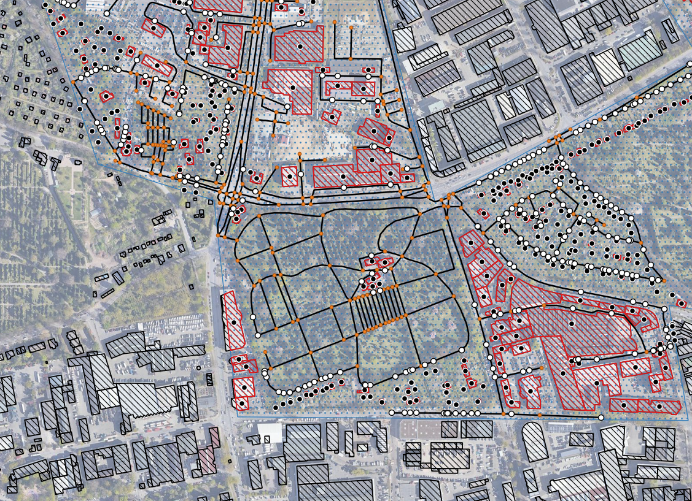

# Roads And Domiciles SNAPPER

## create buildings and roads shapefiles usable for ABM

### Prerequisites
- project_area.shp containing the desired area. Can have holes
- ALKIS buildings shapefile in /data/ALKIS

### What does it do?
- downloads walkable roads from OSM within the project area and saves as shapefile (all line segments are separate)
- clips ALKIS buildings to the project area 
- creates centroids of all buildings
- snaps centroids to closest points on the road network and saves as shapefile

